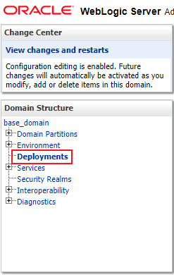
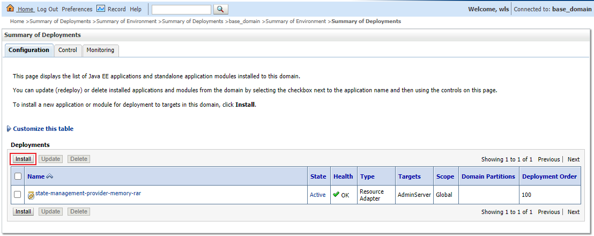
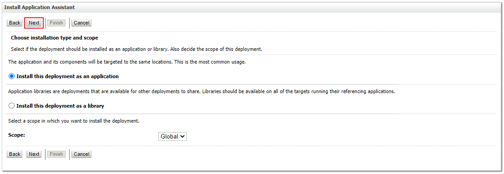
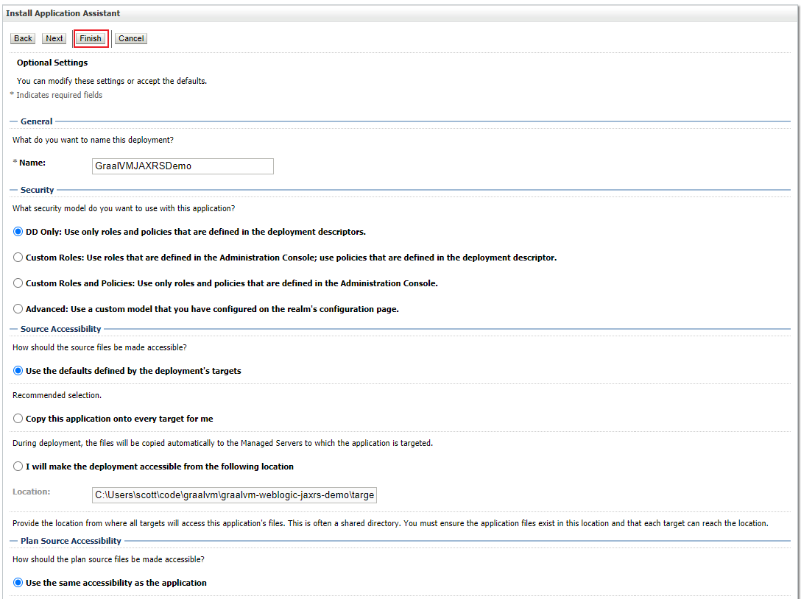
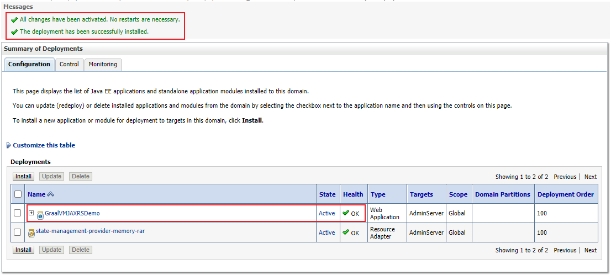

## WebLogic Demo Comparing Hotspot and GraalVM Performance

Install WebLogic Server per the instructions:

**[https://docs.oracle.com/en/middleware/fusion-middleware/12.2.1.4/wlsig/installing-oracle-weblogic-server-and-coherence-software.html#GUID-E4241C14-42D3-4053-8F83-C748E059607A](https://docs.oracle.com/en/middleware/fusion-middleware/12.2.1.4/wlsig/installing-oracle-weblogic-server-and-coherence-software.html#GUID-E4241C14-42D3-4053-8F83-C748E059607A)**

Start the server:


```
<path to WLS>/wls12214/user_projects/domains/base_domain/startWebLogic.sh
```


Clone this project: **[https://github.com/marthenlt/graalvm-weblogic-jaxrs-demo.git](https://github.com/marthenlt/graalvm-weblogic-jaxrs-demo.git)**

Credit goes to Marthen Luther, this is a fork of his original project.

```
$ mvn package
```


Edit <code>&lt;path to WLS>/wls12214/oui/.globalEnv.properties</code>and include the path to both Hotspot VM and GraalVM:


```
#This file is automatically generated
#Mon Dec 21 22:15:05 EST 2020

# Hotspot VM (Java 8)
JAVA_HOME=/Library/Java/JavaVirtualMachines/jdk1.8.0_271.jdk/Contents/Home
JAVA_HOME_1_8=/Library/Java/JavaVirtualMachines/jdk1.8.0_271.jdk/Contents/Home

# GraalVM Enterprise 20.3.0 (Java 8)
#JAVA_HOME=/Library/Java/JavaVirtualMachines/graalvm-ee-java8-20.3.0/Contents/Home
#JAVA_HOME_1_8=/Library/Java/JavaVirtualMachines/graalvm-ee-java8-20.3.0/Contents/Home

JVM_64=
SHORTCUT_FOLDERS=Oracle FMW - 12.2.1.4.0
```


_Uncomment/Comment `JAVA_HOME` to support the demo scenario._


Also edit `<path to WLS>user_projects/domains/base_domain/bin/setDomainEnv.cmd` and add entries for Hotspot and GraalVM:


```
SUN_JAVA_HOME="/Library/Java/JavaVirtualMachines/jdk1.8.0_271.jdk/Contents/Home"
#SUN_JAVA_HOME="/Library/Java/JavaVirtualMachines/graalvm-ee-java8-20.3.0/Contents/Home"
export SUN_JAVA_HOME

DEFAULT_SUN_JAVA_HOME="/Library/Java/JavaVirtualMachines/jdk1.8.0_271.jdk/Contents/Home"
#DEFAULT_SUN_JAVA_HOME="/Library/Java/JavaVirtualMachines/graalvm-ee-java8-20.3.0/Contents/Home"
export DEFAULT_SUN_JAVA_HOME

if [ "${SUN_JAVA_HOME}" = "" ] ; then
	SUN_JAVA_HOME="@DEFAULT_SUN_JAVA_HOME"
	export SUN_JAVA_HOME
fi

if [ "${BEA_JAVA_HOME}" = "" ] ; then
	BEA_JAVA_HOME="@DEFAULT_BEA_JAVA_HOME"
	export BEA_JAVA_HOME
fi

if [ "${VM_TYPE}" = "JRockit" ] ; then
	JAVA_HOME="${BEA_JAVA_HOME}"
	export JAVA_HOME
else
	if [ "${JAVA_VENDOR}" = "Sun" ] ; then
		JAVA_HOME="${SUN_JAVA_HOME}"
		export JAVA_HOME
	else
		JAVA_VENDOR="Oracle"
		export JAVA_VENDOR
		JAVA_HOME="/Library/Java/JavaVirtualMachines/jdk1.8.0_271.jdk/Contents/Home"
		#JAVA_HOME="/Library/Java/JavaVirtualMachines/graalvm-ee-java8-20.3.0/Contents/Home"
		export JAVA_HOME
		VM_TYPE="HotSpot"
		export VM_TYPE
	fi
fi
```


### Deploy the application on WebLogic Server

Point your browser at: [http://localhost:7001/console](http://localhost:7001/console)

Login and choose **‘Deployments’:**





Choose **‘Install’**:




Enter the path to the example application and click **‘Next’**:


Choose **‘Next’**:




Choose **‘Finish’**:




Verify the deployment was successful:




Run the performance tests from the project directory:


```
$ ./run-test.sh
Testing with 20,000,000 (20 millions) iterations ...

Time taken to complete in milliseconds: 3086 ; and result is: 3000000000
real	0m3.118s
user	0m0.005s
sys		0m0.012s
```


Edit both the files once again and comment Hotspot and uncomment GraalVM options to perform tests using GraalVM.


```
<path to WLS>/user_projects/domains/base_domain/bin/setDomainEnv.cmd
<path to WLS>/wls12214/oui/.globalEnv.properties
```


Run the tests again.

```
$ ./run-test.sh
Testing with 20,000,000 (20 millions) iterations ...

Time taken to complete in milliseconds: 139 ; and result is: 3000000000
real	0m0.150s
user	0m0.003s
sys		0m0.005s
```